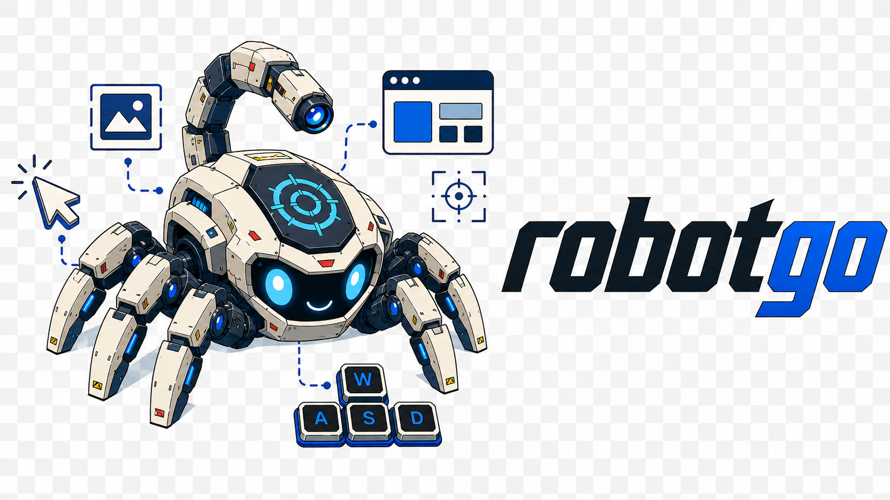

# RobotGo

[](https://github.com/marang/robotgo/actions/workflows/go.yml?query=branch%3Amain)
[](https://github.com/marang/robotgo/releases)
[](https://pkg.go.dev/github.com/marang/robotgo)

<p align="center">
  
</p>

RobotGo is a cross-platform desktop automation library for Go. It controls the
mouse and keyboard, captures screens and pixels, manages windows and processes,
and converts images and bitmaps.

## About this fork

> **This is `marang/robotgo`, not the original `go-vgo/robotgo` module.** Use
> `github.com/marang/robotgo` in `go get` and imports. The two repositories are
> separate Go modules.

This fork has diverged substantially from the original implementation, chiefly
to make Linux automation Wayland-first without weakening macOS, Windows, or
Linux/X11 behavior. Relevant new upstream features are still reviewed
selectively, then adapted, hardened, and tested against this repository's
backend and error contracts rather than merged blindly.

Current technical differences include:

- Native Wayland `wlr-screencopy` capture with DMA-BUF/`wl_shm` selection and
  explicit freedesktop Screenshot and persistent ScreenCast/PipeWire portal
  paths.
- A consent-aware RemoteDesktop portal session client for explicit GNOME/KDE
  pointer and keyboard injection, with cancellable lifecycle and cleanup.
- Error-returning mouse, keyboard, capture, and window APIs alongside legacy
  compatibility APIs.
- Runtime capability reporting that probes live protocols and services and
  explains backend choice, fallback, and unsupported behavior.
- Sway, Hyprland, generic wlroots, and Wayland-core window backend resolution,
  with partial operations reported honestly instead of universal support being
  implied. Hyprland additionally supports reliable active-window maximize
  query, set, restore, and close through provider-aware `hyprctl` dispatch for
  both legacy `hyprlang` and Hyprland 0.55+ Lua configurations.
- A defined non-CGO contract: Pure-Go capture is available through CoreGraphics
  on macOS, native APIs on Windows, and X11. Windows and Linux/X11 additionally
  have keyboard/pointer backends; Wayland capture uses the consent-aware
  Screenshot portal while read-only display geometry uses bounded native
  `wl_output`/`xdg-output` queries. Unavailable GUI operations return
  `ErrNotSupported` rather than plausible zero values.
- Hermetic portal/compositor tests, tagged Wayland integration suites, and CI
  coverage for Linux, macOS, Windows, Wayland, portal, lint, and non-CGO modes.
- Open, auditable native and Go backend code, including explicit resource
  ownership, bounded waits, and fallback diagnostics.

Upstream authorship and history remain credited under
[Upstream and attribution](#upstream-and-attribution). Upstream URLs elsewhere
in that section are historical references, not installation or support links
for this fork.

## Features

| Area | Available functionality |
|---|---|
| Mouse | Move, relative move, smooth move, drag, click, button toggle, scroll, and location where the platform exposes it |
| Keyboard | Key taps and combinations, key state changes, text/Unicode input, delays, and clipboard-assisted input |
| Screen and pixels | Full/region capture, display bounds and scale, pixel/color queries, bitmap conversion and string helpers, image save, and region/tolerance color search |
| Windows | Active window, title, close, minimize/maximize, topmost queries/setters, bounds/client geometry, and compositor-specific Wayland variants where supported |
| Processes | Enumerate, inspect, find, activate, and terminate processes |
| Images | Go image/bitmap conversion, template helpers, encoding, saving, and optional OCR |
| Diagnostics | Versioned, sanitized build/backend, protocol-version, permission, fallback, remediation, and unsupported reporting |

Availability is platform- and backend-dependent. Prefer error-returning APIs
and inspect `GetRuntimeCapabilities` when an operation is required for a
workflow. `GetRuntimeDiagnostics` provides the stable machine-readable report;
`GetLinuxCapabilities` remains the compact Linux-specific view.

`Kill` accepts only a positive process identifier that fits the platform PID
range. Invalid values return `ErrInvalidPID` before any operating-system signal
or termination call; in particular, `Kill(0)` can never target a Unix process
group.

## Support overview

| Platform/session | Build | Current behavior |
|---|---|---|
| macOS | CGO-enabled default build | Native mouse, keyboard, capture, window, and process paths; macOS permissions still apply |
| macOS | `CGO_ENABLED=0` | Pure-Go CoreGraphics capture, display bounds, real Retina scale, Quartz keyboard/pointer input, and Accessibility window inspection/control with explicit permission diagnostics; maximize/topmost and media keys without stable native semantics return `ErrNotSupported` |
| Windows | CGO-enabled default build | Native mouse, keyboard, capture, window, and process paths |
| Windows | `CGO_ENABLED=0` | Pure-Go capture/display bounds, real Win32 DPI scale and pixel-at-pointer queries, foreground-layout-aware `SendInput` keyboard/text plus clipboard paste, complete pointer input, and Win32 window title/PID/handle/geometry/state/control operations with explicit errors |
| Linux/X11 | CGO-enabled default build | X11/XTest input, capture, window, and process paths |
| Linux/X11 | `CGO_ENABLED=0` | Pure-Go X11 capture/bounds, XTEST input, and window title/PID/handle/geometry/state/control through X11/EWMH; horizontal scroll and window mutations without a consistent EWMH window manager are explicitly unsupported |
| Linux/Wayland | CGO with `-tags wayland`; add `pipewire` for persistent ScreenCast frames | Native wlroots capture/input where compositor protocols exist, one-shot Screenshot fallback, reusable ScreenCast/PipeWire capture, explicit RemoteDesktop portal sessions, capability-aware window support |
| Linux/Wayland | `CGO_ENABLED=0` | Screenshot portal capture without implicit Xwayland, bounded native logical output enumeration without consent UI, and explicit RemoteDesktop portal sessions for supported input |

Wayland compositors intentionally restrict global automation. GNOME and KDE can
use consent-aware Screenshot and RemoteDesktop portal paths. The explicit
RemoteDesktop session client is available under `input/portal`. After explicit
consent through `StartRemoteDesktopInput`, supported high-level input APIs use
that session when native virtual input is unavailable; RobotGo never opens the
dialog implicitly. Native pointer and keyboard automation requires the
compositor to expose the corresponding virtual-input protocols. See
[Wayland status](docs/wayland-tasks.md) for the detailed matrix and open work.
Persistent capture runtime evidence is tracked separately in the
[Wayland capture compatibility matrix](docs/compatibility/wayland-capture.md).

## Pure-Go macOS input and windows

With `CGO_ENABLED=0`, macOS keyboard and pointer automation use Quartz events directly
through runtime-loaded system frameworks. `MouseReady`, `KeyboardReady`, and
`GetRuntimeCapabilities` use the same non-prompting
Accessibility preflight: if
access is missing, they return/report `ErrPermissionDenied` with the relevant
System Settings location. RobotGo never opens the consent dialog implicitly.

Keyboard support includes key taps, combinations, ownership-checked persistent
key states, optional process targeting, exact UTF-16 text (including non-BMP
characters), delays, and clipboard-assisted paste. Printable `KeyTap` values
use physical macOS ANSI key positions for shortcut compatibility; use
`TypeStrE` when exact layout-independent text is required. Media/brightness
keys and F21-F24 have no safe stable Quartz keycode and return
`ErrNotSupported`.

Pointer support includes absolute and relative movement, bounded smooth movement,
drag, single/double click, owned button toggles, horizontal/vertical pixel
scrolling, and global pointer location. Persistent holds are ownership-checked;
`CloseMainDisplayE` releases RobotGo-owned keys and buttons before unloading
the native frameworks.

Pure-Go macOS window support uses a non-prompting Accessibility preflight and
stable `CGWindowID` handles. It supports active/PID/handle resolution, title,
AX frame bounds, activation, minimize/restore and minimized-state queries, plus
graceful close through the window's Accessibility close button. macOS does not
expose a reliable cross-application client rectangle, so `GetClient` returns the
same AX frame as `GetBounds`. Maximized and global topmost state have no stable
equivalent and return `ErrNotSupported` explicitly. Call `CloseMainDisplayE` to
release both input and window framework references deterministically. The
CGWindowID-to-Accessibility mapping uses the same runtime-resolved macOS bridge
as the native backend; if that bridge is absent, capability probing reports the
backend as unsupported instead of degrading silently.

On Windows and Linux/X11 Pure-Go window backends, `CloseWindowKill` resolves the
window's actual owner, captures its process identity, acquires a stable process
reference, verifies that the reference still represents that identity, and
revalidates window ownership before requesting the graceful close. Windows
retains one creation-time-verified process handle; Linux verifies the exact
`/proc/<pid>` instance around `pidfd_open` and retains that `pidfd` through the
bounded 1.5-second wait and optional force-kill. Owner/identity changes, failed
probes, and pre-bind exits abort without a destructive fallback. macOS still
performs the graceful close, but returns `ErrNotSupported` if the process
remains alive because macOS offers no equivalent stable process handle for a
safe fallback.

```go
if err := robotgo.KeyboardReady(); err != nil {
	log.Fatal(err)
}
if err := robotgo.KeyTap("c", "cmd"); err != nil {
	log.Fatal(err)
}
if err := robotgo.TypeStrE("Grüße 👋"); err != nil {
	log.Fatal(err)
}
```

See [`examples/purego_macos_input`](examples/purego_macos_input) and
[`examples/purego_macos_pointer`](examples/purego_macos_pointer).

## Requirements

- Go 1.25 or newer, matching [`go.mod`](go.mod).
- A CGO-compatible C toolchain for the full native desktop-automation feature
  set. The supported Pure-Go subsets in the table above work without a C
  compiler; unavailable operations fail explicitly.
- Platform development libraries for the selected backend.

### macOS

Install Go and the Xcode command-line tools:

```bash
xcode-select --install
```

Grant Accessibility and Screen Recording permissions to the application or
terminal that runs RobotGo when macOS requests them.

### Windows

Install Go and a CGO-compatible compiler such as LLVM-MinGW or MinGW-w64. The
compiler must be available on `PATH` when `go build` runs.

### Linux

The default Linux build targets X11 and requires X11/XTest development files.
On Debian/Ubuntu:

```bash
sudo apt update
sudo apt install build-essential pkg-config libx11-dev libxtst-dev
```

For the native Wayland build, install the Wayland, xkbcommon, GBM, and DRM
development files as well:

```bash
sudo apt install libwayland-dev libxkbcommon-dev wayland-protocols libgbm-dev libdrm-dev
```

Persistent ScreenCast frame capture additionally needs PipeWire development
files and the `pipewire` build tag:

```bash
sudo apt install libpipewire-0.3-dev
go build -tags "wayland pipewire" ./...
```

On non-FHS systems where PipeWire headers and libraries are outside the default
compiler paths, derive them from pkg-config before building:

```bash
export CGO_CFLAGS="$(pkg-config --cflags-only-I libpipewire-0.3)"
export CGO_LDFLAGS="$(pkg-config --libs libpipewire-0.3)"
go build -tags "wayland pipewire" ./...
```

Package names differ on other distributions. Optional runtime integrations:

- `xdg-desktop-portal` plus the matching desktop backend provides screenshot
  fallback and consent-aware RemoteDesktop input sessions.
- `xsel` or `xclip` provides clipboard access on Linux.
- `wayland-info` can provide a bounds fallback when native output geometry is
  unavailable.
- `wlrctl`, `swaymsg`, or `hyprctl` enables the compositor-specific window
  operations documented in the [Wayland status](docs/wayland-tasks.md).
- `zenity` or `kdialog` enables native-style alert dialogs on Linux.
- Tesseract is required only for the optional OCR helpers. The default helper
  invokes the `tesseract` command; `-tags ocr` selects the in-process Gosseract
  backend and additionally requires Tesseract and Leptonica development files.

`libpng` is not a direct RobotGo build requirement; PNG/JPEG image handling is
implemented through Go image packages in the current module.

## Installation

Add this fork to a Go module:

```bash
go get github.com/marang/robotgo@latest
```

Import it with the same module path:

```go
import "github.com/marang/robotgo"
```

Do not mix this import with `github.com/go-vgo/robotgo`; Go treats them as
different modules.

## Quick start

Prefer error-returning APIs in automation that must detect unsupported backends
or runtime failures:

```go
package main

import (
	"fmt"
	"log"

	"github.com/marang/robotgo"
)

func main() {
	if err := robotgo.MoveE(100, 200); err != nil {
		log.Printf("move unavailable: %v", err)
	}
	if err := robotgo.ClickE("left"); err != nil {
		log.Printf("click unavailable: %v", err)
	}

	bit, err := robotgo.CaptureScreen(0, 0, 320, 200)
	if err != nil {
		log.Fatal(err)
	}
	defer robotgo.FreeBitmap(bit)

	fmt.Println("capture backend:", robotgo.LastBackend())
}
```

Legacy APIs remain available for source compatibility. Their signatures may be
unable to report all backend failures, so new reliability-sensitive code should
use variants such as `MoveE`, `MoveRelativeE`, `ClickE`, `ScrollE`, `LocationE`,
`TypeStrE`, `UnicodeTypeE`, `AlertE`, and the error-returning window APIs.
On Linux, `AlertE` tries `zenity`, `kdialog`, and `xmessage` before using
`notify-send` for an OK-only informational alert. A cancel-capable alert never
silently degrades to a non-interactive notification; missing or failed backends
are returned explicitly. Legacy `Alert` keeps its bool-only signature.
Context-backed OCR, clipboard, Wayland probe, and compositor command paths also
bound inherited process I/O cleanup. On Unix, cancellation terminates the
one-shot backend's process group so a descendant cannot keep an API call stuck
indefinitely past its documented timeout.
`KeyTap` and `KeyToggle` model keys rather than portable text entry. A selected
backend may support a single non-ASCII rune directly (the RemoteDesktop portal
and Pure-Go X11 do), while another native keymap can return `ErrNotSupported`.
Use `TypeStrE` or `UnicodeTypeE` when the intent is text input.

On native Linux and RemoteDesktop portal paths, stateful `KeyDown`/`KeyUp`
and `MouseDown`/`MouseUp` pairs are backend- and session-affine. Equivalent
key aliases such as `esc`/`escape` match the same hold. A duplicate Down, an
Up without a successful RobotGo-owned Down, or an Up after its portal session
was replaced returns `ErrInputOwnership` without sending input on another
backend. Callers can distinguish this contract with
`errors.Is(err, robotgo.ErrInputOwnership)`. Closing or retargeting a native
backend releases RobotGo-owned state; closing a portal session delegates that
release to the compositor.

Low-level helpers whose signatures directly expose `C.*` types remain CGO-only.
Portable callers should use `Bitmap`, `CHex`, `Handle`, the error-returning APIs,
and the high-level capture, input, and window functions instead.

For concurrent programs, change process-wide legacy defaults atomically with
`GetRuntimeConfig` and `SetRuntimeConfig`. Direct assignments to `MouseSleep`,
`KeySleep`, `DisplayID`, `NotPid`, and `Scale` remain compatible for startup
configuration but must not race with active operations.

When converting caller-provided raw pixels, create an owned value with
`NewBitmap`. Conversion variants such as `ToRGBAGoE`, `ToCBitmapE`,
`ImgToCBitmapE`, and `ByteToCBitmapE` validate dimensions, layout, buffer size,
and decode errors; their legacy counterparts remain available for compatibility.

Potentially blocking helpers have context-aware variants: `ReadAllContext` and
`WriteAllContext` also select the regular or primary Unix clipboard explicitly;
`GetTextContext` and `GetTextImgContext` bound command-backed OCR execution and
temporary-file cleanup. With `-tags ocr`, cancellation is observed before and
after the synchronous in-process Tesseract call; that native call cannot itself
be interrupted.

## Linux display backends

### X11

The normal Linux build uses the X11 backend:

```bash
go build ./...
```

RobotGo normally detects an X11 session through `DISPLAY` and requires an
accessible X server. Native CGO builds may instead select an explicit target
with `SetXDisplayName`, even when both display-server environment variables are
empty. `DetectDisplayServer` remains an environment-only observation; runtime
backend information and capabilities report the explicitly selected X11
target. A Wayland environment remains authoritative, so RobotGo does not route
a Wayland-primary operation through X11 merely because Xwayland is present.
CGO binaries compiled with `-tags wayland` retain the XGB/Xinerama `Capture`,
`CaptureImg`, and bounds compatibility paths when run in a real X11 session.
`CaptureImgNative` provides an explicit portal-free capture boundary: it uses
the session's native backend and returns an error instead of opening or reusing
a desktop portal. On Wayland it attempts compositor screencopy only.

Linux/X11 also supports capture, bounds, and input without a C compiler or X11
development headers:

```bash
CGO_ENABLED=0 go build ./...
```

The input backend requires a reachable X server with XTEST 2.2 or newer. It
supports the high-level mouse/keyboard error APIs, text and Unicode, smooth
movement/drag, scroll, pointer location, and live
`KeyboardReady`/`MouseReady` probes. Pure-Go X11 scroll calls are bounded to
1,000 steps per axis. XTEST input is global; process-target (`pid`) arguments
are rejected explicitly.
Single-character keys are tap-only; persistent key state requires a named key.
Persistent pointer-button toggles are limited to core X11 buttons 1–5. Pure-Go
X11 supports vertical `ScrollE`; horizontal scrolling returns
`ErrNotSupported` because core XTEST button 6/7 state is not observable safely.
`GetRuntimeCapabilities` reports the selected `pure-go-x11` backend.
Key taps without an unambiguous active mapping and text use a bounded pool of
originally unmapped X11 keycodes so delayed XKB clients still decode input
correctly. If one connection exhausts that server-dependent pool of distinct
symbols, the operation fails before injecting more input. Call
`CloseMainDisplayE` only after targets have processed all prior keyboard input
to restore the mappings, verify cleanup, and reset the pool. Place that call in
a scope whose lifetime includes any delayed target processing.

These mappings are server-global, so the Pure-Go backend owns its X11
connection in a separate, re-executed guardian process. If the application
process exits unexpectedly or receives `SIGKILL`, control-socket EOF makes the
guardian run a bounded, conditional cleanup: it releases RobotGo-owned
keys/buttons, allows up to two seconds for already delivered text events, and
restores a scratch before-image only while the current mapping still exactly
matches RobotGo's recorded final image and that keycode is neither pressed nor
a modifier. A different final image is treated as another client's state and
is preserved. X11 cannot reveal an ABA change where another client changes a
mapping and later puts back the exact same image, so that case is inherently
indistinguishable from RobotGo's ownership.

Guardian startup requires Linux procfs to expose `/proc/self/exe` and the
sandbox/service policy to permit re-executing the current program and using
Linux abstract Unix sockets. The parent accepts only the authenticated socket
peer whose kernel credentials match the helper it started; no control file
descriptor is inherited through the re-exec initialization phase. Re-exec can
still repeat dependency initializers that run before RobotGo's guardian
initializer. Those initializers must not block or terminate the helper; if they
prevent its authenticated handshake, startup fails before an X11 input
connection is exposed. Failure is explicit, the failed helper is reaped, and
there is no silent in-process X11 fallback. Crash cleanup also requires the
guardian and X server to remain alive and responsive. A
simultaneous guardian/container/host kill, X-server loss, or an X11 transport
that remains blocked beyond the cleanup deadline cannot be restored
synchronously. Request dispatch and cleanup are deadline-bounded; on a blocked
transport the guardian initiates connection close and exits, while the parent
kills and reaps a helper that misses its final exit deadline.

Explicit `CloseMainDisplayE` remains the deterministic path because it reports
actionable cleanup/transport errors and lets callers choose when even
arbitrarily delayed target clients have finished processing input. A foreign
mapping replacement is deliberately relinquished without being reported as a
cleanup failure because overwriting it would be unsafe. A later RobotGo
operation reconnects lazily. In a Wayland-primary session the backend remains
disabled, even when `DISPLAY` points to Xwayland.
If cleanup reports that a scratch keycode is pressed or became a modifier,
release or restore that external state and retry `CloseMainDisplayE`.

The same non-CGO X11 build provides active-window and PID/handle resolution,
title lookup, client and frame geometry, activation, minimize/maximize state,
topmost state, and graceful close. Read-only operations require an accessible
X server. Mutations additionally require a consistent EWMH window-manager
identity that advertises the requested operation and fail with
`ErrNotSupported` when either condition is absent;
RobotGo does not send an optimistic request to an absent or non-advertising
manager. EWMH operations remain asynchronous window-manager requests.
Restoring a minimized window requests activation, matching EWMH semantics.
Window properties are treated as untrusted server data: malformed values are
rejected, and invalid frame extents fall back to client geometry. Each
operation closes its short-lived X11 connection deterministically.

RobotGo briefly grabs the X server around mapping/state checks and composite
synthetic events so another X client cannot race those transactions. Core X11
cannot attribute simultaneous physical input, or another press while RobotGo
intentionally holds a key/button; state ownership in those cases remains
best-effort. Avoid mixing automation with concurrent human or synthetic input.

The native CGO X11 path never installs temporary server-global key mappings.
It types printable ASCII represented by the active keymap and preflights the
complete string before the first event, so an unmapped later character cannot
leave partial text or a held modifier. `UnicodeTypeE` follows the same
fail-closed rule for non-ASCII code points. Compound input never releases a
main key or modifier that was already held outside RobotGo. Active Shift,
Level3/Level5, and lock state is preserved and reused only when it produces the
requested character exactly; conflicting shortcut state fails before mutation.
Persistent native `KeyUp` must match a successful RobotGo `KeyDown`, and only
RobotGo-owned keycodes are released. Use the Pure-Go X11 build when full Unicode
text and its explicit scratch-mapping lifecycle are required. Native
`KeyboardReady`/`MouseReady` also verify a live XTEST 2.2 connection. Xlib
operations share a locked configured-display lifecycle; separate XGB resolver
connections use the same configured target and close deterministically.

Error-returning window APIs no longer report success for native operations that
have no implementation. In particular, the native CGO X11
minimize/maximize path returns `ErrNotSupported` instead of silently doing
nothing; the Pure-Go EWMH path described above implements those operations.
Native `GetTitleE` also returns an explicit error when a title is empty or
cannot be retrieved.

### Wayland

Build the native Wayland paths explicitly:

```bash
go build -tags wayland ./...
```

This is a Wayland-targeted build, not a dual X11/Wayland window backend. In a
pure X11 session it reports Window and Hook capabilities as unavailable;
error-returning window operations return `ErrNotSupported`. Use the default
Linux build for an X11 session.

Wayland display bounds use logical compositor coordinates in both native and
Pure-Go builds. `GetScreenRect()` and `GetScreenRect(-1)` return the aggregate
desktop rectangle, including a negative origin. `GetScreenSize()` returns the
selected primary output size. Non-negative indices select individual outputs
in deterministic order:
the output containing logical `(0,0)` is index `0`, followed by top-to-bottom,
left-to-right geometry order. `DisplaysNum()` queries Wayland directly, while
`GetMainId()` returns the resulting primary index `0`; neither requires
Xwayland. An out-of-range index returns a zero rectangle; it never silently
falls back to the aggregate desktop. Native
`xdg-output` logical geometry takes precedence, preserving fractional scale;
the core-output fallback applies integer scale and all eight transforms. The
Pure-Go query is read-only, bounded, closes its Unix connection after every
atomic snapshot, and never opens a portal consent dialog.
Native `zwlr_virtual_pointer_v1` absolute moves use the same aggregate logical
origin, so displays positioned left of or above the primary output do not wrap
negative global coordinates into the protocol's unsigned absolute frame.

Capture selection is:

1. Native `wlr-screencopy` using DMA-BUF when supported.
2. Native `wl_shm` when DMA-BUF is unavailable or unsuitable.
3. An already authorized persistent ScreenCast/PipeWire session, when one was
   explicitly started.
4. The freedesktop Screenshot portal when native capture fails and portal use
   is allowed.

The portal may prompt the user. Native screencopy and virtual input are most
useful on wlroots compositors; availability is probed at runtime rather than
inferred from environment variables alone.

For repeated GNOME/KDE capture, build with `-tags pipewire`, explicitly open
one consent session, then read as many frames as required without creating a
new portal request per frame:

```go
ctx := context.Background()
err := robotgo.StartScreenCastCapture(ctx, robotgo.ScreenCastCaptureOptions{
	Sources: robotgo.ScreenCastSourceMonitor,
	Cursor:  robotgo.ScreenCastCursorEmbedded,
	Persist: robotgo.ScreenCastPersistApp,
})
if err != nil {
	log.Fatal(err)
}
defer robotgo.CloseScreenCastCapture()

frame, err := robotgo.CaptureScreenCast(ctx) // image.Image
```

`CaptureScreenCast(ctx, x, y, width, height)` crops in logical compositor
coordinates and maps fractional stream scaling to physical pixels.
`CaptureScreenCastDisplay(ctx, displayID, x, y, width, height)` additionally
requires the active selected stream to be an unambiguous monitor geometry match
for that display and fails closed before reading a frame otherwise. Agent
capture uses this display-bound variant so an allow-listed display cannot expose
pixels from a different monitor, window, or virtual stream.
`ScreenCastCaptureStreams` exposes selected stream geometry and PipeWire
metadata; `ScreenCastCaptureRestoreToken` returns the newest single-use restore
token. Keep restore tokens private and replace the stored token after every
restored session. `CaptureScreen` continues to prefer native screencopy, then
reuses an active ScreenCast session on native failure. Use
`ROBOTGO_WAYLAND_BACKEND=screencast` only when the persistent session should be
mandatory.

The image capture backend supports hidden and embedded cursor modes. Raw cursor
metadata remains available to lower-level `OpenScreenCast` consumers, but
`OpenPipeWireCapture` rejects that mode explicitly because its `image.Image`
result cannot represent separate cursor metadata. Starting a capture waits for
the PipeWire stream to reach a usable state; an idle session recycles frames
without converting them until a capture is requested.

For explicit GNOME/KDE portal input, probe support without prompting and then
call `StartRemoteDesktopInput` with the required device mask. While that session
is active, relative movement, buttons/clicks, scrolling, key taps/toggles, text,
and Unicode can fall back to it when native input is unavailable. Native
Wayland `TypeStrE` preflights the complete rune sequence and injects supported
text exactly. If a rune is absent from the active keymap, it produces zero
native input and safely uses an active keyboard-granted RemoteDesktop session;
without one it returns `ErrNotSupported`. Runtime seat removal or keyboard
capability changes are processed without blocking and reconnect to the next
deterministic capable seat. The lower-level `input/portal` package additionally
exposes relative pointer motion, smooth and discrete axes, pointer buttons, and
keycode/keysym events.
`StartRemoteDesktopInputWithOptions` can attach monitor/window/virtual
ScreenCast sources to the same consent session. Selected stream position and
logical size then let `MoveE` map global coordinates to absolute portal input;
touch down/motion/up is available when the portal grants touchscreen access.
Stream metadata includes the node ID, optional mapping ID and PipeWire serial,
and a persistence restore token without exposing that token through
diagnostics. Restore tokens are single-use: store them securely, pass the latest
value as `RemoteDesktopInputOptions.RestoreToken`, and replace it with the token
returned by the restored session. For multiple streams, the optional `displayId`
argument to `MoveE` selects the stream by its returned slice index; without it,
RobotGo uses logical stream positions. The session must be closed
deterministically.

RemoteDesktop keyboard and relative-pointer capability remains available when
only the optional ScreenCast probe is degraded. In that case `Probe` returns the
usable partial capability together with the ScreenCast error. Inspect
`Capability.ScreenCastIssue` or `RemoteDesktopInputStatus.ScreenCastReason`
before relying on absolute input, touch, or stream metadata.
Consent diagnostics distinguish `not-requested`, `granted`, `closed`,
`cancelled`, `timed-out`, `denied`, `failed`, and `unavailable`. A timeout means
the caller's consent deadline elapsed; it does not imply that the portal itself
is unavailable.

Successful portal-backed `MoveE`, `MoveRelativeE`, `ClickE`, and `ScrollE`
honor the same `MouseSleep` and scroll-delay behavior in CGO and non-CGO builds.

The example defaults to probe-only mode:

```bash
go run ./examples/remote_desktop_input
go run ./examples/remote_desktop_input -connect
go run ./examples/remote_desktop_input -connect -screen
# Read the example before using the opt-in input demo:
go run ./examples/remote_desktop_input -demo -screen
go run ./examples/remote_desktop_input -demo -touch
```

Useful capture controls:

| Variable | Values/effect |
|---|---|
| `ROBOTGO_WAYLAND_BACKEND` | `auto`, `dmabuf`, `wl_shm`, `screencast`, or `portal` |
| `ROBOTGO_FORCE_PORTAL=1` | Force screenshot portal capture |
| `ROBOTGO_DISABLE_PORTAL=1` | Disable portal prompts and fallback |
| `ROBOTGO_CAPTURE_DEBUG=1` | Log backend selection and fallback decisions |

`LastBackend` reports the backend used by the latest capture. Long-running
Wayland applications can call `CloseWaylandInput` to release persistent virtual
pointer and keyboard objects; later input calls reconnect lazily.

Successful non-CGO capture reports `BackendX11` on supported X11 systems,
`BackendPortal` on Linux/Wayland, and `BackendPureGo` on other supported
Pure-Go platforms.

Global pointer position and global foreign-window control are not universally
available in Wayland core. `LocationE` and unsupported window operations return
`ErrNotSupported`. Sway, Hyprland, and some wlroots environments have partial
window support through compositor-specific tools; inspect capabilities instead
of assuming parity with X11. Hyprland window mutations query
`hyprctl status -j` and select the active `hyprlang` or Lua dispatcher syntax;
older Hyprland versions without the status request keep the legacy path.
Transport failures and successful but malformed/unknown provider responses
fail before mutation.

Pure-Go Windows builds provide window introspection and control through Win32:
active handle/PID, title, outer/client bounds, activation, minimize/maximize,
topmost state, and graceful close. PID lookup prefers a visible, unowned
top-level window and falls back to another top-level window owned by the
process. Windows may deny `SetActiveE` under its foreground-activation policy;
the error is returned instead of reporting false success.

### Runtime diagnostics

`GetRuntimeBackendInfo` is platform-neutral and reports whether the current
binary contains native CGO backends or the Pure-Go compatibility build. It does
not open portals or contact a compositor:

```go
info := robotgo.GetRuntimeBackendInfo()
fmt.Println("implementation:", info.BuildImplementation)
fmt.Println("cgo:", info.CGOEnabled)
fmt.Println("platform:", info.GOOS, info.GOARCH)
fmt.Println("display:", info.DisplayServer)
```

`GetRuntimeCapabilities` adds feature-level status. It may perform bounded
runtime probes, but never opens a consent dialog:

```go
caps := robotgo.GetRuntimeCapabilities()
fmt.Println("capture:", caps.Capture.Available, caps.Capture.Backend, caps.Capture.Reason)
fmt.Println("bounds:", caps.Bounds.Available, caps.Bounds.Backend, caps.Bounds.Reason)
fmt.Println("keyboard:", caps.Keyboard.Available, caps.Keyboard.Backend, caps.Keyboard.Reason)
fmt.Println("mouse:", caps.Mouse.Available, caps.Mouse.Backend, caps.Mouse.Reason)
fmt.Println("process:", caps.Process.Available, caps.Process.Backend)
```

`GetRuntimeDiagnostics` returns the versioned schema used by support tooling.
It adds negotiated Wayland/portal/XTEST versions, non-prompting permission
state, and remediation while excluding display addresses, restore tokens,
stream identifiers, and unrelated environment values:

```go
ctx, cancel := context.WithTimeout(context.Background(), 2*time.Second)
defer cancel()
report := robotgo.GetRuntimeDiagnostics(ctx)
fmt.Println("schema:", report.SchemaVersion)
fmt.Println("protocols:", report.Protocols)
fmt.Println("permissions:", report.Permissions)
fmt.Println("remediation:", report.Remediation)
```

The published support contract is
[Runtime Compatibility Matrix v1](docs/compatibility/runtime-v1.md).

On Linux/X11 with `CGO_ENABLED=0`, capability inspection reports the selected
`pure-go-x11` keyboard and mouse backends without opening an X connection. Call
`KeyboardReady` or `MouseReady` for a live XTEST 2.2+ check before acting. A
Wayland-primary session never selects that backend merely because an Xwayland
`DISPLAY` is present.

In a `CGO_ENABLED=0` build, `Capture`, `CaptureImg`, `CaptureScreen`,
`CaptureGo`, `CaptureBitmapStr`, `GetPixelColor`, and `GetPxColor` use the
Pure-Go CoreGraphics, Windows, or X11 screenshot backend where available.
Wayland sessions use this fork's hardened screenshot portal and preserve
`ROBOTGO_DISABLE_PORTAL`; unsupported targets return `ErrNotSupported`
explicitly. Portal-provided temporary screenshot files are unlinked immediately
after an identity-verified open, including decode-error and cancellation paths,
so sensitive desktop images are not left behind. Decoding follows the capture
context and rejects symlinks, changed file identities, encoded or estimated
decoded PNG data above 512 MiB, and dimensions above 32,768 pixels per axis.
On macOS, capture returns `ErrPermissionDenied` with
remediation when Screen Recording access is absent; capability inspection
never requests that permission implicitly.

Display geometry has error-returning variants: `GetDisplayBoundsE`,
`GetScreenSizeE`, `GetScreenRectE`, and `DisplaysNumE`.
Use them when backend availability matters. A Pure-Go Wayland build queries
`wl_output` and prefers `xdg-output` logical geometry without consulting an
Xwayland `DISPLAY` or opening a consent dialog. Missing protocols, invalid
geometry, compositor stalls, and connection failures return explicit errors;
legacy counterparts retain zero-value compatibility.
CGO-enabled Linux keeps the legacy `Capture` helper and bounds on the selected
session path (native protocol or its documented Wayland fallback), so a
Wayland-primary path never falls through to X11.

Use `CaptureImg()` with no arguments for a full-screen capture. Region capture
requires at least `x, y, width, height`; partial argument lists, non-positive
region dimensions other than the explicit `0x0` full-screen request,
coordinate overflow, and a non-zero origin combined with a
`0x0` full-screen request are rejected before a portal request is created.
Explicit regions whose 32-bit RGBA buffer would exceed 512 MiB are also
rejected before a backend allocates capture memory.

On Linux, `GetPixelColor` and `GetPxColor` use the selected capture backend for
a 1x1 region. Out-of-bounds coordinates and capture failures therefore return
an error instead of being indistinguishable from a valid black pixel.

`CaptureBitmapStr` serializes the selected backend's captured pixels in the
versioned `robotgo.bitmap.v1` format. `FindBitmapStr` accepts one optional
serialized haystack and otherwise captures the screen; its result is relative
to that haystack. `FindColorCS` searches an explicit capture region and returns
absolute screen coordinates. Its optional tolerance defaults to `0.01` and
must be a finite value from `0` (exact) through `1` (any RGB color). All three
helpers preserve capture backend errors.

`GetLinuxCapabilities` reports the detected session, compositor, selected
feature backends, fallbacks, and unsupported reasons:

```go
caps := robotgo.GetLinuxCapabilities()
fmt.Println("display:", caps.DisplayServer)
fmt.Println("compositor:", caps.Compositor)
fmt.Println("capture:", caps.Capture.Backend, caps.Capture.Available, caps.Capture.Fallback)
fmt.Println("keyboard:", caps.Keyboard.Backend, caps.Keyboard.Available, caps.Keyboard.Reason)
fmt.Println("mouse:", caps.Mouse.Backend, caps.Mouse.Available, caps.Mouse.Reason)
fmt.Println("remote desktop:", caps.RemoteDesktop.Backend, caps.RemoteDesktop.Available, caps.RemoteDesktop.Reason)
fmt.Println("window:", caps.Window.Backend, caps.Window.Available, caps.Window.Reason)
```

Run the complete diagnostic example with:

```bash
go run ./examples/runtime_diagnostics
go run -tags wayland ./examples/linux_capabilities
```

### Policy-gated agent sessions

The `agent` package adds a strict Go boundary for automation agents without
changing the legacy package-level API. One process-exclusive session exposes a
versioned operation catalog, policy and confirmation gates, bounded observation,
dry-run, typed move/click/text requests, stale-target protection, post-action
verification, and sanitized structured results. Its catalog reports that the
underlying input backend remains process-global and that cancellation is
currently guaranteed before dispatch, not during a synchronous OS input call.
Direct callers of legacy RobotGo APIs remain outside this exclusivity.
For pointer moves, `AllowedDisplayIDs` fails closed: the selected display must
be allowed and the global target coordinates must fall within its live bounds.
If display geometry cannot be resolved, no input is injected.

`Session.Observe` always returns sanitized runtime diagnostics and can optionally
capture one explicit in-memory region. `MaxObservations`, `MaxCapturePixels`,
and `AllowedDisplayIDs` bound those reads. Pixels are excluded from JSON and
audit events; `Observation.Image` returns a defensive copy, while
`Observation.Close` and `Session.Close` zero RobotGo-owned capture buffers.
The implementation also enforces hard ceilings of 16,777,216 pixels per frame,
100 verification attempts, 60 seconds between attempts, and five minutes per
verification, even when a caller requests larger policy values.
On Wayland, agent capture uses an already-active ScreenCast stream when
available. It never opens a portal consent dialog implicitly; callers must
start consent-aware ScreenCast themselves or explicitly select native-only
capture with `ROBOTGO_DISABLE_PORTAL=1`.

An action can reference a captured observation through
`ObservationPrecondition`. RobotGo recaptures the same internally retained
region immediately before input and rejects a changed target as `stale-target`.
Optional `capture-changed` or `capture-unchanged` verification then polls within
the policy's fixed attempt, interval, timeout, pixel, and observation budgets.
If input completed but proof did not, the result is `unverified` rather than a
misleading failure that might invite an unsafe retry. `AuditSink` receives only
payload-free lifecycle metadata; an intent-delivery failure prevents desktop
I/O, and a completion-delivery failure is returned alongside the actual action
outcome. Audit sinks are synchronous and must not call back into their invoking
session. `DryRun` never injects input, but a supplied observation precondition
still performs a real bounded recapture and consumes observation quota.

The example is validation-only by default and never injects input unless
`-act` is supplied explicitly:

```bash
go run ./examples/agent_session -operation observe
# Explicit sensitive read; pixels stay in memory and are zeroed on close.
go run ./examples/agent_session -operation observe -capture \
  -x 0 -y 0 -width 320 -height 200 -display 0
go run ./examples/agent_session -operation move -x 100 -y 100 -display 0
go run ./examples/agent_session -act -operation move -x 100 -y 100 -display 0
# Explicit sensitive read plus click mutation and bounded changed-region proof.
go run ./examples/agent_session -act -operation click -verify changed \
  -x 0 -y 0 -width 320 -height 200 -display 0
```

### Local MCP adapter for agents

`robotgo-mcp` exposes the policy-gated session to a local MCP client over
stdio. It has four focused tools: `robotgo_capabilities`, `robotgo_observe`,
`robotgo_act`, and `robotgo_close`. With no policy flag it is diagnostics-only:
capture, display access, and desktop mutation are denied. `robotgo_act` is also
dry-run by default, so actual input needs both an explicit policy and
`mode: "execute"`; normal session confirmation rules still apply.

Run it directly from the repository:

```bash
go run ./cmd/robotgo-mcp
```

Or install the local stdio server for an MCP host to launch:

```bash
go install ./cmd/robotgo-mcp
robotgo-mcp
```

An MCP-host entry can then use `robotgo-mcp` as its command without a network
URL. Stdout is reserved for MCP frames; diagnostics and startup errors go to
stderr.

To opt into more capability, pass a strict policy JSON file. This example
allows bounded observations and pointer moves on display 0, requires explicit
confirmation for every move, and still grants no text or capture access:

```json
{
  "allowed_operations": ["desktop.observe", "pointer.move"],
  "confirm_operations": ["pointer.move"],
  "allowed_display_ids": [0],
  "max_actions": 10,
  "max_text_runes": 0,
  "max_observations": 20,
  "max_capture_pixels": 0
}
```

```bash
robotgo-mcp -policy /absolute/path/to/policy.json
```

Policy input is size-bounded, rejects unknown fields and trailing JSON, and is
never read from stdin. MCP observation output includes sanitized diagnostics
and optional geometry, but never pixels or internal capture digests. Session
close zeroes any in-memory captures. See the
[adapter and evaluation plan](docs/plan/agent-adapter-evaluation.md) for the
security boundary and intentionally deferred tools.

## Examples

The checked-in examples use this fork's module path and track the current API:

- [Mouse](examples/mouse/main.go)
- [Keyboard and clipboard](examples/key/main.go)
- [Screen capture and pixels](examples/screen/main.go)
- [Full-screen capture with backend reporting](examples/screen_full/main.go)
- [Cross-platform aggregate and per-output bounds](examples/display_bounds/main.go)
- [Policy-gated agent session](examples/agent_session/main.go)
- [Linux capabilities](examples/linux_capabilities/main.go)
- [Cross-platform runtime capabilities](examples/runtime_capabilities/main.go)
- [Versioned runtime diagnostics](examples/runtime_diagnostics/main.go)
- [Pure-Go X11 input probe and opt-in demo](examples/purego_x11_input/main.go)
- [Pure-Go X11 window inspection and opt-in EWMH control](examples/purego_x11_window/main.go)
- [Pure-Go Windows input readiness and opt-in demo](examples/purego_windows_input/main.go)
- [Pure-Go Windows window inspection and opt-in control](examples/purego_windows_window/main.go)
- [Pure-Go macOS window inspection and opt-in control](examples/purego_macos_window/main.go)
- [Consent-aware RemoteDesktop portal input](examples/remote_desktop_input/main.go)
- [Persistent ScreenCast/PipeWire capture](examples/screencast_capture/main.go)
- [Bitmap-string and region color-search helpers](examples/capture_helpers/main.go)
- [Hyprland active-window maximize state](examples/wayland_window_state/main.go)
- [Window and process helpers](examples/window/main.go)
- [Display scaling](examples/scale/main.go)

Examples perform real desktop actions. Read them before running them, especially
the window/process example, which can close windows or terminate processes.
The Pure-Go X11 example is safe to run as capability inspection by default; it
performs global input only when both `-act` and an explicit action are supplied:

```bash
CGO_ENABLED=0 go run ./examples/purego_x11_input
CGO_ENABLED=0 go run ./examples/purego_x11_input -act -move 100,100
CGO_ENABLED=0 go run ./examples/purego_x11_input -act -key enter
CGO_ENABLED=0 go run ./examples/purego_x11_input -act -text "Hello"
```

Keyboard actions keep scratch mappings alive for two seconds before verified
cleanup. Increase `-settle` when the focused XKB client may process input later.

The Pure-Go X11 window example only inspects by default. State-changing
operations require `-act` and an explicit action:

```bash
CGO_ENABLED=0 go run ./examples/purego_x11_window
CGO_ENABLED=0 go run ./examples/purego_x11_window -pid 1234
CGO_ENABLED=0 go run ./examples/purego_x11_window -pid 1234 -act -maximize
```

The Pure-Go macOS window example is also inspection-only by default. It requires
Accessibility permission; mutation requires an explicit `-action`:

```bash
CGO_ENABLED=0 go run ./examples/purego_macos_window
CGO_ENABLED=0 go run ./examples/purego_macos_window -pid 1234
CGO_ENABLED=0 go run ./examples/purego_macos_window -action minimize
CGO_ENABLED=0 go run ./examples/purego_macos_window -action restore
```

On Windows, the Pure-Go example performs readiness checks only unless `-move`,
`-text`, `-paste`, or `-color` is supplied. `-paste` replaces the text
clipboard before sending Control+V:

```powershell
$env:CGO_ENABLED = "0"
go run ./examples/purego_windows_input
go run ./examples/purego_windows_input -move 400,300 -text "Hello"
go run ./examples/purego_windows_input -color -paste "Hello from the clipboard"
```

`SendInput` is subject to Windows User Interface Privilege Isolation: a
normal-integrity process cannot inject input into a higher-integrity target.
Persistent `KeyDown`/`MouseDown` state is owned by the backend and released by
`CloseMainDisplayE`; callers should still use balanced operations or `defer`
cleanup because process termination cannot run in-process cleanup.

The Windows window example is read-only by default. `-activate` and `-minimize`
are explicit opt-ins:

```powershell
$env:CGO_ENABLED = "0"
go run ./examples/purego_windows_window
go run ./examples/purego_windows_window -pid 1234
go run ./examples/purego_windows_window -handle 123456 -activate
go run ./examples/purego_windows_window -pid 1234 -minimize
```

## Testing

Run the default and explicit non-CGO contracts first:

```bash
go test ./...
CGO_ENABLED=0 go test ./...
go test -race ./input/portal
```

Linux X11 input has non-skipping Xvfb/XTEST CI checks. The deep Pure-Go suite
uses `us,de` layouts; a separate job applies the same public behavioral
contract and benchmark smoke to native CGO and Pure-Go binaries. It also proves
that native readiness rejects a reachable X server with XTEST disabled. Missing
X11 runtime support fails instead of skipping; see
[the testing guide](TEST.md#x11integration-native-and-pure-go-x11-input-and-window) for
the exact commands and prerequisites. The crash proof additionally inspects
`/proc/<pid>/task/<tid>/children` under a Linux child subreaper to verify that
the reported guardian is the exact child that exits and is reaped. The
[current decision-grade comparison](docs/performance/data/x11-2026-07-17-fd97f7e/summary.md)
measures the guardian path and retains native CGO as the X11 default while
Pure-Go remains the supported CGO-disabled backend. The earlier direct-path
sample remains linked from the performance report as historical evidence.
The stable remote checks are required by `main` branch protection. Real
GNOME/KDE/wlroots jobs remain opt-in until matching runners are registered.

Wayland and portal code has additional tagged suites:

```bash
go test -tags "wayland" ./...
go test -tags "portal" ./screen/portal -v
go test -tags "wayland test" ./screen -run TestScreencopy -v
go test -tags "wayland integration" . ./mouse ./window -v
```

See [TEST.md](TEST.md) for prerequisites, DRM tests, keyboard integration, and
opt-in compositor E2E checks.

Real Wayland input results are tracked in the
[versioned compatibility matrix](docs/compatibility/wayland-input.md).

## Documentation and roadmap

- [Go API reference](https://pkg.go.dev/github.com/marang/robotgo)
- [Key names and conversion](docs/keys.md)
- [Testing guide](TEST.md)
- [Release evidence format and verification](docs/compatibility/release-evidence-v1.md)
- [Upstream compatibility audit](docs/compatibility/upstream-master.md)
- [X11 native-vs-Pure-Go evidence](docs/performance/x11-native-vs-purego.md)
- [Current Wayland support and backlog](docs/wayland-tasks.md)
- [Product roadmap](docs/plan/product-roadmap.md)
- [Wayland implementation history](docs/wayland-history.md)

The active product slice is Phase 5 reliability hardening. Runtime Diagnostics
v1, native sanitizer/leak gates, and a six-cell release-evidence workflow make
support claims machine-readable and tied to exact source, test logs, and build
identity. Published releases receive a checksummed evidence bundle. The
remaining infrastructure blocker is protected real GNOME/KDE/wlroots evidence.
Phase 4 already exposes the parity surface; Hyprland provides trustworthy
active-window maximize query, set, and restore with provider-aware dispatch for
legacy `hyprlang` and 0.55+ Lua configurations, while Sway and generic wlroots
retain explicit unsupported query results where their available IPC lacks an
equivalent state. The preceding Linux/X11 evaluation is complete: shared
behavior is blocking CI, current guardian-path decision evidence is versioned,
and native CGO remains the default while Pure-Go supports CGO-disabled builds.
Pure-Go X11 now covers capture, input, and window introspection/control; its
EWMH mutations fail explicitly without a trustworthy window manager. The input
core is race-testable and its separate guardian performs bounded, claim-checked
cleanup after an application-process crash. Its request transport now reuses
bounded state and avoids double payload encoding, with versioned evidence
showing lower allocation cost. Balanced transient press/release pairs now share
one guardian request while preserving per-step crash-cleanup ownership and the
existing preflight/server-grab policy. Required remote checks now protect
`main`.
Pure-Go Windows input is a delivered platform slice, with hermetic transaction
tests and a blocking real input-desktop pointer probe on the Windows CI runner.
Pure-Go Windows window introspection/control is the next delivered slice, with
a self-owned Win32 test window covering PID/handle resolution, title, geometry,
state changes, activation, topmost state, and graceful close. Further macOS and
Windows backends remain selective work. Real
GNOME/KDE/wlroots validation is an independent Wayland release gate.

## Upstream and attribution

This fork descends from [go-vgo/robotgo](https://github.com/go-vgo/robotgo) and
preserves its history and license notices. The original RobotGo author is
[vz](https://github.com/vcaesar); upstream contributors remain credited in the
Git history and source headers. These links are intentionally upstream
attribution, not installation or support links for this fork.

Development, issues, CI, and current contributors for this fork live at:

- [marang/robotgo](https://github.com/marang/robotgo)
- [Issues](https://github.com/marang/robotgo/issues)
- [Current contributors](https://github.com/marang/robotgo/graphs/contributors)

## License

RobotGo is distributed under the [Apache License 2.0](LICENSE). Vendored or
generated components retain their applicable notices in the source tree.
